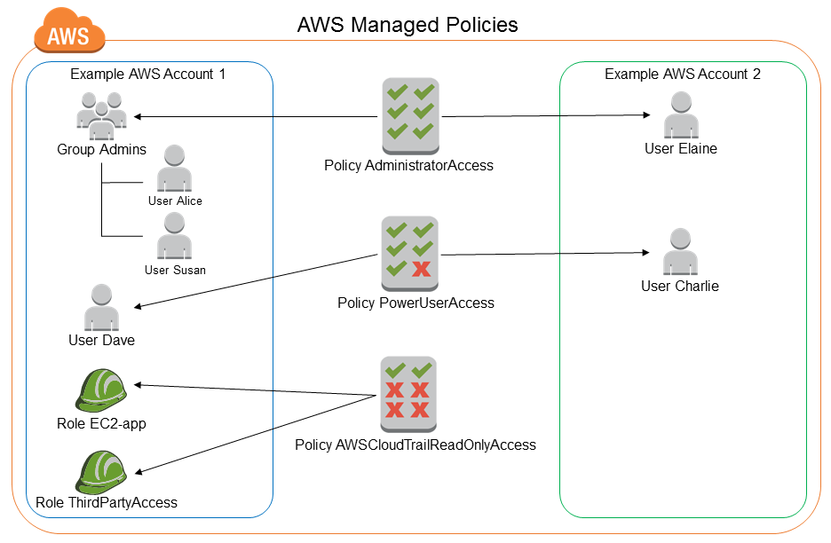

# What is IAM

- IAM (Identity And Access Management)
- Global service
- Root created by default
- Regular users can be created and grouped
- Groups can be assigned permissions
- Individual users can also be assigned permissions independently

    <td></td>

## Permissions And Policies

- User and groups can be attached to documents called POLICIES
- Policies = permissions that users are allowed to do
- AWS Best Practice: Use least privilege principle
<table>
<tr>
    <td></td>
    <td></td>
</tr>
</table>

## Quick Terminology check!
- EC2 = VM / Server / computer in the remote location 
- S3 = storage solution / hard disk in the remote location 
- Policy = permissions / rules / restrictions given to aws developers

## IAM DEMO
User - Group - Policies - Password policy - MFA

### MFA (Multi Factore Authentication) Device
- Google Authenticator - only phone
- Authy - Multiple device
- Yubikey - 3rd party physical device 

## Access AWS
Amazon Web Services (AWS) can be accessed through the following three primary methods:
### Console access (Web UI)	
- This is the most common way for users to interact with AWS services. You access the AWS Management Console through a web browser.
- You log in using your AWS account username and password.

### Aws command line interface (AWS CLI)
- AWS CLI is command line tool that allow you to interact with AWS service using commands in your terminal or command prompt.
- To use the AWS CLI, you need to configure it with access keys (Access key ID and Secret Access Key) associated with your AWS account. You can get these key from the AWS Management Console.

#### Installation
Here's a step-by-step guide to installing the AWS CLI, creating access keys, configuring the CLI, and executing some basic commands. For the most up-to-date information, always refer to the official AWS documentation.
#### [Installing the AWS CLI Updated Docx.](https://docs.aws.amazon.com/cli/latest/userguide/getting-started-install.html)
#### Create Access Keys

##### Access Key Creation

- Log in to the AWS Management Console.
- Go to the IAM (Identity and Access Management) dashboard.
- Navigate to "Users" and select the user for whom you want to create access keys.
- In the "Security credentials" tab, click on "Create access key."
- Note down the Access Key ID and Secret Access Key. These keys are required for configuring the AWS CLI.

##### Configure AWS CLI.

- Open a terminal or command prompt on your local machine.
- Run the following command:
`aws configure`
- Enter the Access Key ID, Secret Access Key, default region, and output format as prompted.

##### Execute Commands
- Now you can use the AWS CLI to interact with AWS services. Here are a few examples:
- List S3 buckets `aws s3 ls`
- Describe EC2 instances: `aws ec2 describe-instances`
- Create an S3 bucket: `aws s3api create-bucket --bucket YOUR_BUCKET_NAME --region YOUR_REGION`
- Adjust these commands based on your use case and the AWS service you want to interact with.

### Aws software development kit (AWS SDK):
- AWS provides SDKs for various programming languages (e.g., Python, Java, JavaScript,PHP etc.).
- Developers can use the SDKs to integrate AWS services into their applications.
- Like the AWS CLI, the SDKs also require access keys for authentication.
[Ref Here](https://docs.aws.amazon.com/code-library/latest/ug/what-is-code-library.html)

In both CLI and SDK cases, it's essential to manage and secure your access keys. Access keys should be treated like a username/password combination and should be kept secure. The use of IAM (Identity and Access Management) roles and policies is encouraged to control and manage access to AWS resources.

`Accesskeys = access key id + secret access keys`

## IAM Roles

### IAM Roles:

- IAM roles are used to grant permissions to entities in AWS, whether they are AWS services, users, or AWS resources such as EC2 instances.
- Roles are not directly attached to machines; instead, they are assumed by entities (users, applications, or services).
- For AWS resources like EC2 instances, IAM roles are often associated with them to grant specific permissions.

### IAM Policies:

- IAM policies are JSON documents that define permissions. They can be attached to IAM users, groups, or roles.
- IAM policies define what actions are allowed or denied on what resources.
- While IAM policies are commonly attached to IAM users, they can also be attached to IAM roles.

### In summary:

`IAM User`: Represents a person or service with permanent long-term credentials (username and password). IAM policies can be attached directly to IAM users.

`IAM Role`: Represents a set of permissions that are attached to an entity (such as an EC2 instance or Lambda function) but is not associated with a specific user or service. Roles are assumed by entities to obtain temporary security credentials.

`IAM Policy`: Defines permissions and can be attached to IAM users, groups, or roles. It specifies what actions are allowed or denied on what resources.

#### Policy Example
Here's a simple example of an IAM policy in JSON format that defines permissions for an S3 bucket. This policy grants an IAM user the ability to list the objects in a specific S3 bucket named "example-bucket" and to perform "GetObject" actions on all objects within that bucket
```
{
  "Version": "2012-10-17",
  "Statement": [
    {
      "Effect": "Allow",
      "Action": [
        "s3:ListBucket",
        "s3:GetObject"
      ],
      "Resource": [
        "arn:aws:s3:::example-bucket",
        "arn:aws:s3:::example-bucket/*"
      ]
    }
  ]
}

```
Explanation:

`Version`: Indicates the version of the policy language. In this case, it's "2012-10-17," which is the current policy language version as of my last knowledge update in January 2022.

`Statement`: Defines the permissions. In this example, there's one statement.

- Effect: Specifies whether the permissions are allowed ("Allow") or denied ("Deny").

- Action: Lists the actions that are allowed or denied. Here, the user is allowed to perform "s3:ListBucket" and "s3:GetObject" actions.

- Resource: Specifies the AWS resource to which the actions apply. The "Resource" field is set to the Amazon Resource Names (ARNs) of the S3 bucket and its objects.

In summary, this IAM policy grants an IAM user the necessary permissions to list the contents of the specified S3 bucket and retrieve objects from it. IAM policies can become more complex, allowing fine-grained control over various AWS services and resources.


#### Example:

An EC2 instance can assume an IAM role, and that IAM role has an associated IAM policy specifying what AWS actions that EC2 instance is allowed to perform.

Roles are often used to grant permissions to AWS resources without the need for permanent credentials, which enhances security by reducing the exposure of long-term access keys. They are commonly used in scenarios like EC2 instances needing to access S3 buckets or other AWS services.

## IAM Security

### IAM Credential Report
- The IAM credential report provide a details of the status and configuration of IAM users their various credential (password,access keys, ec.).
- It includes information on when the credentials were last used, when they are created , and when they are set to expire.
- The report can generate in the AWS Management Console or via AWS Command line Interface(CLI).

### Account Level Observation
- At the account level, you can use services like AWS CloudTrail to monitor and log all API activity across your AWS infrastructure. This is valuable for security and compliance audits.
- AWS Config can also be used to assess, audit, and evaluate the configurations of your AWS resources.

### IAM Access Advisor:
- IAM Access Advisor is a tool that helps you visualize the permissions granted to an IAM user.
- It shows the services and actions that an IAM user or role has accessed and the time of access.
- This feature assists in understanding the permissions that are actively being used and can help refine policies to adhere to the principle of least privilege.
### Last Service Access Information:
- The AWS Management Console provides information about when a user last accessed AWS services. This can be useful in identifying inactive accounts or those with infrequent usage.
- Additionally, `CloudTrail` logs can be analyzed to retrieve detailed information on API calls made by IAM users, including when the services were last accessed.
### User Level Observation:
- IAM Policies and Groups can be configured at the user level to ensure that users have the minimum required permissions for their tasks.
- Monitoring and alerting can be set up using `CloudWatch` to detect unusual activity at the user level, such as multiple failed login attempts or suspicious API calls.

In summary, combining `IAM Credential Reports, AWS CloudTrail, AWS Config, IAM Access Advisor, and monitoring user-level` activity provides a comprehensive approach to IAM security. Regularly reviewing and updating IAM policies, monitoring service access, and using tools provided by AWS contribute to maintaining a secure and well-managed IAM environment.

