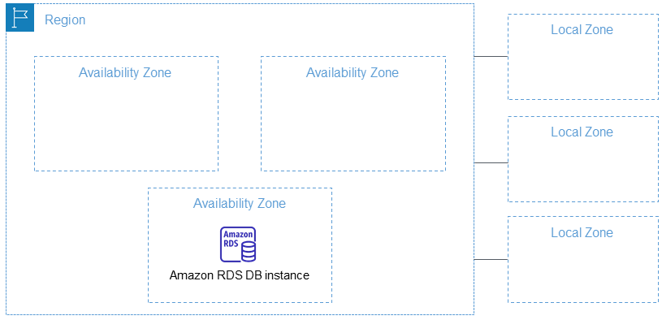

# AWS Certified Solutions Architect Associate Certification SAA-C03!

## What Is Going To Happen!
- Will be preparing AWS Certified Solutions Architect Associate Certification SAA-C03!
- Will be covering more than 28 aws services
- This course overlaps pretty much of associate developer & sysops course 

## How will be the exam taken?
- 65 multiple choice questions
- 130 minute
- 150 USD
- Pearson VUE testing center or online proctored exam.
- Pass mark 720 Or 72%

## Intruduction To AWS
### Amazon Web Services - Cloud provider

Amazon Web Services (AWS) is a comprehensive and widely used cloud computing platform provided by Amazon.com. Launched in 2006, AWS has since become a leading player in the cloud services industry, offering a vast array of infrastructure services, computing power, storage options, and a variety of other cloud-based products and solutions. 

### Provide servers and relevant services that can be used on demand and scale easily

### Used by many giant companies
- Amazon
- Netflix
- Facebook
- Nasa
- And many more!

### How to create AWS Account
- Root user email
- Root user password
- Personal details
- Credit Card
- Phone number verification
- Support 

Note: If you face any issue about creating account, try to connect aws live support.

### AWS  Global Infrastructure
- AWS Regions
- AWS Availability Zones
- AWS Data Centers
- AWS Edge Locations / Points of Presence

#### AWS Regions	
- [https://aws.amazon.com/about-aws/global-infrastructure](https://aws.amazon.com/about-aws/global-infrastructure/)
- Consist of availability zone
- Most of the aws services are region scoped
#### Which region is right for me?
- Pricing
- Distance/latency (It's nesecary for smooth sevice, try to select regions less distance to user)
- Available aws services (Each regions havn't all service)
- Government rules (Store data own server)

#### Availability Zone
- A region consist of many availability zones.Like:- Mumvai Region Have 3 zone.
- Min: 3 
- Max: 6
- [Global Infrastructure](https://aws.amazon.com/about-aws/global-infrastructure/)
- Each Availability zone consist of one or more data centers connected by high speed low latency internet

### Note:
`33 Launched Regions each with multiple Availability Zones (AZs)`

`105 Availability Zones`

`600+ Points of Presence and 13 Regional Edge Caches`

Availability Zone Example bellow show:-
<table>
  <tr>
    <td></td>
    <td></td>
  </tr>
</table>

### Each Zone Have Multiple `Data Center`

### AWS Edge Locations / Points of Presence
- AWS has more than 600+ Edge Locations, and 13 regional mid-tier caches in over 90 cities across 48 countries
- Used mainly for caching
- So content is delivered to end users with lower latency

## AWS Global And Regional Services
<table border="1">
  <tr>
    <th>Global Service</th>
    <th>Regional Service</th>
  </tr>

  <tr>
    <td>IAM</td>
    <td>EC2</td>
  </tr>
  <tr>
    <td>Route 53</td>
    <td>Lambda</td>
  </tr>
  <tr>
    <td>Cloudfront</td>
    <td>Recognition</td>
  </tr>
  <tr>
    <td>WAF</td>
    <td>
        <a href="https://aws.amazon.com/about-aws/global-infrastructure/regional-product-services/">Regional View Clicl Here</a>
    </td>
  </tr>
</table>

### Global Service

#### IAM (Identity and Access Management):

`IAM` is a web service for securely controlling access to AWS resources. It allows you to create and manage AWS users and groups and use permissions to allow and deny their access to AWS resources.
#### Route 53:

`Route 53` is a scalable domain name system (DNS) web service designed to route end-user requests to globally distributed AWS resources. It enables domain registration, DNS routing, and health checking of resources.
#### CloudFront:

Amazon `CloudFront` is a content delivery network (CDN) service that securely delivers data, videos, applications, and APIs to customers globally with low latency and high transfer speeds. It integrates with other Amazon Web Services products to give developers and businesses an easy way to distribute content to end-users.
#### WAF (Web Application Firewall):

### Regional Service

AWS `WAF` is a web application firewall that helps protect web applications from common web exploits that could affect application availability, compromise security, or consume excessive resources.

#### EC2 (Elastic Compute Cloud):

Amazon `EC2` is a web service that provides resizable compute capacity in the cloud. It allows users to run virtual servers, known as "instances," on-demand. `EC2` instances can be used for a wide range of applications, including hosting websites, running applications, and processing data.
#### Lambda:

AWS `Lambda` is a serverless computing service that lets you run your code without provisioning or managing servers. You can execute code in response to events, such as changes to data in an Amazon `S3` bucket, updates to a DynamoDB table, or HTTP requests via API Gateway.
#### Recognition (Assuming Amazon Rekognition):

Amazon `Recognition` is a service for image and video analysis. It provides APIs for facial recognition, object detection, scene understanding, and other computer vision tasks. It's commonly used for applications involving image and video analysis, such as building smart applications that can automatically recognize and understand visual content.

