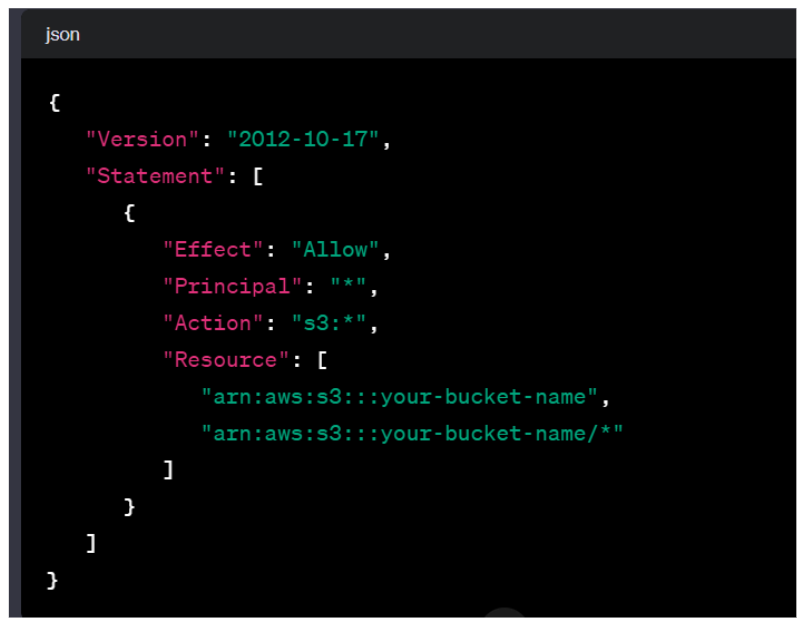
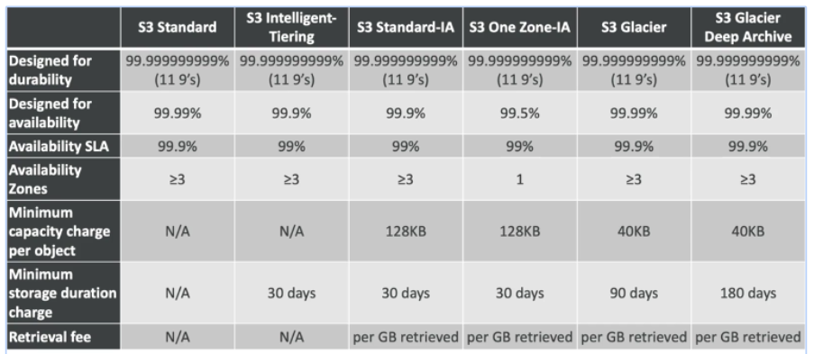
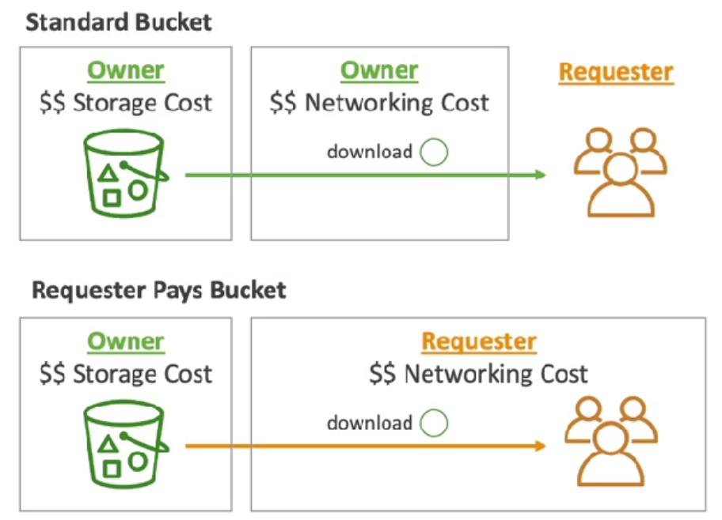

# 🚀 Amazon S3 🚀
 
## Amazon S3 - Introduction

Amazon S3, or Simple Storage Service, is a fundamental component of AWS offering infinitely scalable storage for various use cases. Key applications include:

- **Backup and Storage:**
  - S3 serves as a reliable and scalable solution for data backup and long-term storage.

- **Disaster Recovery:**
  - With its high durability and availability, S3 is a crucial element in disaster recovery strategies.

- **Archive:**
  - Organizations leverage S3 to archive data, providing cost-effective long-term storage with easy retrieval.

- **Host Applications:**
  - S3 can host static files for web applications, providing a secure and scalable content delivery solution.

- **Media Hosting:**
  - Content creators and media companies use S3 for storing and serving multimedia files due to its efficiency and low-latency access.

- **Static Websites:**
  - Hosting static websites on S3 is a popular choice, benefiting from its simplicity, reliability, and cost-effectiveness.

Amazon S3's versatility and scalability make it a cornerstone for a wide array of storage needs within the AWS ecosystem.

## S3 - Buckets
- `S3` allows us to store objects in buckets.(object semiliear file,folder)
- Buckets must have globally unique name in AWS
- Buckets are defined at regional level
- `S3` dashboard is global scoped but buckets inside the dashboard are regional service (`So S3 is a regional service with global dashboard`)

## S3 - Objects

In Amazon S3, objects are fundamental units of storage, each identified by a unique key. The key represents the full path within the bucket, creating a hierarchical structure, but it's important to note that S3 doesn't have an actual directory system.

### Object Key Structure:

- Example: `s3://the_bucket/the_file.txt` or `s3://the_bucket/folder/another_folder/the_file.txt`
- The object key is composed of two parts:
  - Prefix: `/folder/another_folder`
  - Object Name: `the_file.txt`
  
**Note:** Despite appearances, `S3 doesn't have a directory system`, even though it may seem look like directory system.

### The objects have key and value
- Values are the content of the body
- `Max object size is 5TB`
- `If uploading more than 5GB, must use multipart upload.` If file size more then > 5GB, should be used seperate file means multipart.

## S3 Security
- User based
    - IAM policies - Which api calls should be allowed to be allowed for a user
- Resource based
    - S3 bucket policies - Bucket wide rules from the s3 console - allows: 
        - cross account
        - Specific users
    - Object access control list (ACL)
    - Bucket access control list (ACL)

An IAM principal can access an S3 object if
1. The user iam policy allows it / the resource policy allows it
2. And there no explicit deny

## S3 Bucket Policy 
<table>
  <tr>
    <td>
      <ul>
        <h3>Typically route traffic to a single resource:</h3>
          - This implies that S3 bucket policies are often designed to manage and control access to a specific S3 resource.
        <li><b>Resources:</b> bucket and objects</li>
          - Specifies the entities (bucket and objects) that the policy applies to.
        <li><b>Principal:</b> iam user/account</li>
          - Defines the IAM user or AWS account that the policy is applied to, specifying who is granted or denied access.
        <h3>Use s3 bucket for policy to:</h3>
          - Indicates specific use cases for implementing S3 bucket policies.
        <li>Grant public access to the bucket</li>
          - Grants public access to the content stored in the bucket, potentially for hosting static websites or making certain files publicly accessible.
        <li>Force objects to be encrypted at upload</li>
          - Ensures that any objects uploaded to the bucket are encrypted, enhancing the security of stored data.
        <li>Grant access to another account</li>
          - Allows cross-account access, enabling specified AWS accounts to access the resources in the S3 bucket.
      </ul>
    </td>
    <td></td>
  </tr>
</table>

## S3 - Versioning
- You can version your files in S3
- Enabled at bucket level
- Uploading same key/file will update the version
- Protect against unintended deletion
- Restore old version
- Any file that is not versioned prior to enabling the versioning will have version null
- Suspending versioning will not delete the previous versions

## S3 - Replication
- Must enable versioning for source and target bucket
- Cross region replication
- Same region replication
- Buckets can be in different aws accounts
- Copying is asynchronous
- Must give proper iam permissions to s3
- Only new objects will be replicated after enabling
- To replicate existing object you have to use s3 batch replication
- There’s not chaining of replication
- Use case:
  - CRR: lower latency access,replication to cross account
  - SRR: live replication between prod and dev env,
## S3Sstorage Classes
S3 Storage Classes 
- Amazon S3 Standard - General Purpose 
- Amazon S3 Standard-Infrequent Access (IA)
- Amazon S3 One Zone-Infrequent Access 
- Amazon S3 Glacier Instant Retrieval 
- Amazon S3 Glacier Flexible Retrieval 
- Amazon S3 Glacier Deep Archive 
- Amazon S3 Intelligent Tiering 

Can move between classes manually or using S3 Lifecycle configurations
## Durability & Availability
Durability:
- High durability (99.999999999%, || 9's) of objects across multiple AZ
- If you store 10,000,000 objects with Amazon S3, you can on average expect to incur a loss of a single object once every 10,000 years
- Same for all storage classes

Availability:
- Measures how readily available a service is
- Varies depending on storage class
Example: S3 standard has 99.99% availability = not available 53 minutes a year

### S3 Standard - General purpose
- 99.99% Availability
- Used for frequently accessed data 
- Low latency and high throughput
- Sustain 2 concurrent facility failures
- Use Cases: Big Data analytics, mobile & gaming applications, content distribution...etc

### Infrequent access
- For data that is less frequently accessed, but requires rapid access when needed 
- Lower cost than S3 Standard

Amazon S3 Standard-Infrequent Access (S3 Standard-IA)
- 99.9% Availability
- Use cases: Disaster Recovery, backups
Amazon S3 One Zone-Infrequent Access (S3 One Zone-IA)
- High durability (99.999999999%) in a single AZ; data lost when AZ is destroyed
- `**99.5% Availability**`
- Use Cases: Storing secondary backup copies of on-premise data, or data you can recreate

### Glacier Storage classes**
Low-cost object storage meant for archiving/backup Pricing: price for storage + object retrieval cost
- Amazon S3 Glacier Instant Retrieval
  - Millisecond retrieval, great for data accessed once a quarter
  - Minimum storage duration of 90 days
- Amazon S3 Glacier Flexible Retrieval (formerly Amazon S3 Glacier): 
  - Expedited (I to 5 minutes), Standard (3 to 5 hours), Bulk (5 to 12 hours) 
  - free Minimum storage duration of 90 days
- Amazon S3 Glacier Deep Archive - for long term storage:
  - Standard (12 hours), Bulk (48 hours)
  - Minimum storage duration of 180 days
### S3 Intelligent Tiering
- Small monthly monitoring and auto-tiering fee
- Moves objects automatically between Access Tiers based on usage 
- There are no retrieval charges in S3 Intelligent-Tiering
  - Frequent Access tier (automatic): default tier
  - Infrequent Access tier (automatic): objects not accessed for 30 days 
  - Archive Instant Access tier (automatic): objects not accessed for 90 days
  - Archive Access tier (optional): configurable from 90 days to 700+ days 
  - Deep Archive Access tier (optional): config. from 180 days to 700+ days
  
You can also create s3 lifecycle rule manually if u dont want to use s3 int. tiering

### S3 storage classes

### S3 - Moving Between Storage Classes

<table>
  <tr>
    <td>
      <ul>
         <li>If you know your objects will be infrequently accessed - move them to standard IA If u want to archive the objects</li>
         <li>move them to glacier / glacier deep archive.</li>
          You can move objects between storage classes Which can be automated via lifecycle rules
      </ul>
    </td>
    <td></td>
  </tr>
</table>

### S3 - Lifecycle Rules
- Transition Actions - configure objects to transition to another storage class
  - Move objects to Standard IA class 60 days after creation
  - Move to Glacier for archiving after 6 months
- Expiration actions - configure objects to expire (delete) after some time 
  - Access log files can be set to delete after a 365 days
  - Can be used to delete old versions of files (if versioning is enabled)
  - Can be used to delete incomplete Multipart uploads

`Rules can be created for a certain prefix (example: s3://mybucket/mp3/*)`

`Rules can be created for certain objects Tags (example: Department: Finance)`

### S3 - Lifecycle Rules Scenario 1
You have a application running. People submit their profile photo - are uploaded in s3. This images are also converted to thumbnails, which can be easily recreated and we want them to store only 60 days. The source image should be immediately retrievable within 60 days ,afterwards user can wait up to 6 hours. How will you design it? 

- S3 source images can be on Standard, with a lifecycle configuration to transition them to Glacier after 60 days
- S3 thumbnails can be on One-Zone IA, with a lifecycle configuration to expire them (delete them) after 60 days

### S3 - Lifecycle Rules Scenario 2
A rule in your company states that you should be able to recover your deleted s3 objects immediately for 30 days, although this may happen rarely. After this time, and for up to 365 days, deleted objects should be recoverable within 48 hours.
- Enable S3 Versioning in order to have object versions, so that "deleted objects” are in fact hidden by a "delete marker” and can be recovered 
- Transition afterwards to Glacier Deep Archive

### S3 analysis
How do we decide how many days to put in specific storage class and then move?
- We can use S3 storage class analysis
- Helps you to decide when to transition objects to the right storage class
- Compatible with S3 standard and standard IA
- Not compatible with glacier and one zone IA
- Reports are updated daily

### S3 - Requester pays

<table>
  <tr>
    <td>
      <ul>
         <li>In general, bucket owners pay for all Amazon S3 storage and data transfer costs associated with their bucket</li>
         <li>With Requester Pays buckets, the requester instead of the bucket owner pays the cost of the request and the data download from the bucket</li>        
         <b>Helpful when you want to share large datasets with other accounts.   The requester must be authenticated in AWS (cannot be anonymous)</b>
      </ul>
    </td>
    <td></td>
  </tr>
</table>

