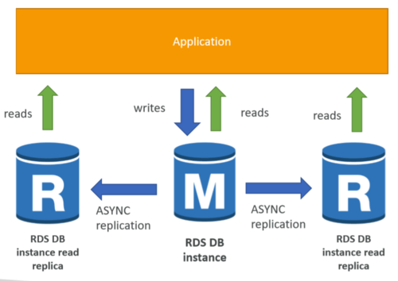
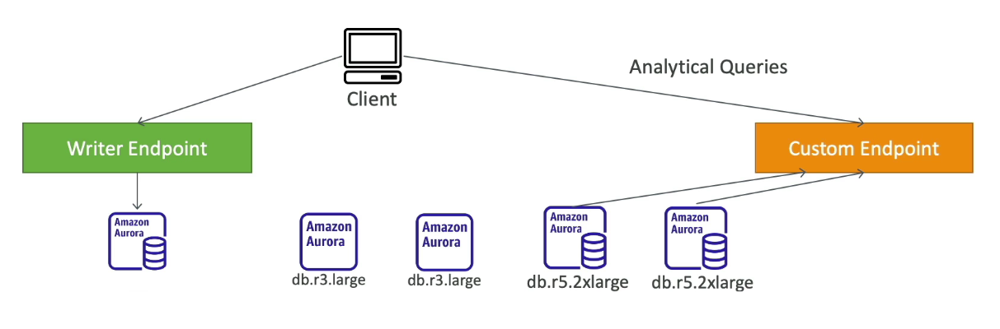
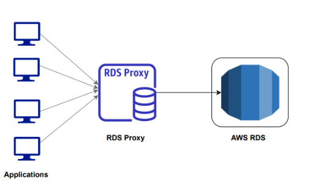
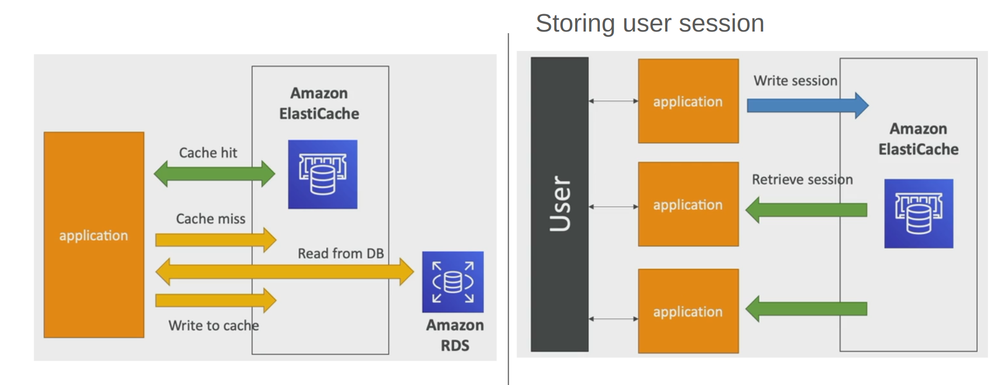

## AWS RDS - Relational Database Service

- Managed DB by AWS to use SQL query language
- We can create - Mysql - Postgres - MariaDB - Oracle - Microsoft SQL Server - Aurora (AWS proprietary db)
  Note: It's one kind of server less service. we dont need take any kinds of responsibility about this service.

## Benefits Of Using RDS

Using Amazon RDS (Relational Database Service) offers several benefits, and the mentioned features contribute to making database management more efficient and reliable. Here's an overview of the benefits you listed:

1. Automated Provisioned by AWS
   Amazon RDS simplifies the database setup process by automating the develpoment and configuration of database instance. This reduce the manual effort required for proisioning and ensures in the setup.

2. Automated OS Patching
   RDS automates the process of applying operating system patches, which helps in keeping the database system secure and up to date without manual intervention.

3. Continuous backups & PITR (point in time restore)
   RDS provides automated and continuous backups of your database. Point-in-Time Restore (PITR) allows you to restore the database to a specific in time, helping in data recovery and rollback scenarios.

4. Monitoring dashboard
   RDS offers a monitoring dashboard that provides insights into the performance metrics of your database. This helps in identifying issues, optimizing performance, and ensuring that the database is running efficiently.

5. Multi AZ setup for disaster recovery
   Multi-AZ (Availability Zone) setup in RDS ensures high availability and fault tolerance. In the event of a failure in one Availability Zone, the system automatically fails over to another, minimizing downtime and providing disaster recovery capabilities.

6. Read replica for better read performance
   Read replicas in RDS allow you to create copies of your database that can be used for read-only operations. This helps in distributing read traffic, improving overall performance, and scaling the application without impacting the primary database.

7. Scalability
   RDS provides options for vertical and horizontal scalability. Vertical scaling involves increasing the resources (CPU, RAM) of the existing instance, while horizontal scaling involves adding read replicas to distribute the workload.
8. EBS Storage is used (gp2/io1)
   RDS uses Amazon Elastic Block Store (EBS) for storage, providing scalable and high-performance storage options. The gp2 and io1 types offer different performance characteristics, allowing you to choose the storage option that best fits your application's needs.

9. No SSH Access to Database Instance:

Restricting SSH access to the database instance enhances security by reducing the attack surface. Database management tasks can be performed through the AWS Management Console, CLI, or APIs provided by AWS.

In summary, Amazon RDS simplifies and automates many aspects of database management, providing a scalable, highly available, and secure environment for your relational databases. The features you've highlighted contribute to operational efficiency, data durability, and improved performance.

## Autoscaling On RDS

1. When RDS detects you are running out of free database space, it scales automatically.
2. Automated modification happens if
   - Free storage is less than 10% of allocated storage
   - Low storage lasts more than 5 minutes
   - 6 hours have since last modification

## RDS Read Replicas For Read Scalability

The use case you described highlights the flexibility and benefits of using RDS Read Replicas for read scalability, especially in scenarios where there is a need to offload read-intensive workloads. Let's break down the key points:

1. Up to 5 Read Replicas:

RDS allows you to create up to 5 Read Replicas for a given source database. This provides the flexibility to distribute read traffic and scale out horizontally as needed.

2. Within AZ, Cross AZ, or Cross-Region:

Read Replicas can be created within the same Availability Zone (AZ), across different AZs within the same region, or even in different AWS regions. This allows for strategic placement based on factors such as latency, fault tolerance, and geographic distribution.

3. Replication is ASYNC, so reads are eventually consistent:

The asynchronous replication model means there might be a slight delay between the primary database and its replicas. This introduces an eventual consistency model, which is usually acceptable for read-intensive workloads.

4. Replicas can be promoted to their own DB:

In case of a failure or for maintenance purposes, a Read Replica can be promoted to become its own standalone database. This promotes high availability and flexibility in managing the database architecture.

5. Applications must update the connection string to leverage read replicas:

To take advantage of Read Replicas, applications need to be configured to direct read queries to the appropriate replica. This requires updating the connection string in the application to include the endpoint of the Read Replica.

### Use Case Scenario:

`Scenario`: You have a production database that is handling normal operational load.

`Requirement`: You need to run a reporting application to perform analytics and generate reports.

`Solution`: Create a Read Replica dedicated to handling the reporting workload.

### Implementation Steps:

- `Create Read Replica`: Set up a Read Replica of the production database.
Configure Reporting Application: Update the connection string in the reporting application to direct read queries to the newly created Read Replica.
- `Offload Reporting Workload`: The reporting application now runs analytics and generates reports using the Read Replica, offloading read traffic from the primary database.
- `Scalability and Performance`: As the reporting workload increases, you can add more Read Replicas or scale up the existing replicas to handle additional read queries.
- `Promotion (if needed)`: If necessary, the Read Replica can be promoted to its own standalone database for further analysis or reporting.

### Note:

Read replicas are ideally suited for SELECT (read) queries and are not intended for handling write operations such as INSERT, UPDATE, or DELETE. The primary database continues to handle write operations while the replicas handle read-intensive tasks, ensuring a balanced and scalable architecture.

## Network Cost
- In AWS whenever data goest cross AZ there is a network cost
- But in RDS Read Replica Same region data transfer is free
- But Cross region transfer is not free

## RDS Multi AZ (Disaster Recovery)
Enabling Multi-AZ (Availability Zone) deployment in Amazon RDS provides enhanced availability and disaster recovery capabilities. Here are the key points regarding RDS Multi-AZ for disaster recovery:

- One DNS Name - Automatic Failover to Standby:

When you enable Multi-AZ for your RDS instance, AWS automatically provisions a standby replica in a different Availability Zone. Both the primary and standby instances share the same DNS name. In the event of a failure or maintenance on the primary instance, Amazon RDS automatically initiates a failover to the standby instance, ensuring minimal downtime.

- Zero Downtime Operation to Go from RDS Single AZ to Multi-AZ:

You can enable Multi-AZ deployment for an existing RDS instance with zero downtime. The process involves modifying the DB instance to enable Multi-AZ, and during this modification, RDS creates a standby replica in a different Availability Zone. The failover to the standby instance is automatic and transparent to the application.

#### Steps to Enable Multi-AZ with Zero Downtime:

1. `Navigate to RDS Console:` Access the AWS Management Console and navigate to the Amazon RDS service.

2. `Select the DB Instance:` Choose the RDS instance for which you want to enable Multi-AZ.

3. `Modify the DB Instance:` Click on the "Modify" button to modify the DB instance settings.

4. `Enable Multi-AZ:` In the modification options, locate the "Multi-AZ Deployment" section and select the option to enable Multi-AZ.

5. `Apply Changes:` Apply the changes to initiate the modification process. During this process, RDS creates a standby replica in a different Availability Zone.

6. `Automatic Failover:` Once the modification is complete, automatic failover is configured. If a failure occurs on the primary instance or during maintenance, RDS will automatically promote the standby instance to the primary role, maintaining high availability.

### RDS Custom 
Gives us capability to configure os and database customization
- Configure settings
- Install patches
- Enable native features
- Access underlying EC2 using SSH
`Note`: It's service olny compatible with `Oracle` & `Microsoft SQL server`

## Amazon Aurora
- Proprietary technology from `AWS`
- `Postgres` and `MySQL` both supported as Aurora DB
- Aurora is mainly ‘`AWS optimized`” 
    - 5X performance over MySQL on RDS
    - 3X performance over Postgres on RDS
- Grows automatically `10GB → 128TB`
- Aurora can have up to `15 replicas`,faster replication(sub `10ms replica lag`)
- Failover is very fast and instantaneous
- Cost 20% more than RDS

## Aurora High Availability

- `Stores 6 Copies of Your Data Across 3 AZ`: Aurora replicates your data across multiple Availability Zones (AZs) for high availability. Each 10GB segment of your database volume is `replicated six ` ways across `three AZs`.
    - `4 Copies Out of 6 is Needed for Writes`: Aurora is designed to maintain high durability and availability. For write operations to proceed, a quorum of four copies out of the six must be available. This ensures data consistency and fault tolerance.
    - `3 Copies Out of 6 is Needed for Read`: For read operations, Aurora requires a quorum of three copies out of the six to be available. This allows for distributed and scalable read access across multiple instances.

- `Self-Healing with Peer-to-Peer Replication`: Aurora employs a self-healing architecture with peer-to-peer replication. If any replica becomes unavailable or if data inconsistencies are detected, Aurora automatically performs recovery and repairs, ensuring data integrity.

- `Master + 15 Read Replicas`: urora supports up to 15 read replicas in addition to the primary instance. This allows for horizontal scaling of read workloads, distributing read queries across multiple instances for improved performance.

- `Support Cross-Region Replication`: Aurora Global Database enables cross-region replication, allowing you to create read replicas in different AWS regions. This feature is useful for disaster recovery and serving read traffic to users in different geographic locations.

- `Backtrack: Restore Data at Any Point in Time Using Backups`: Aurora provides the Backtrack feature, allowing you to restore your database to any point in time within a specific retention period. This feature is valuable for recovering from unintentional data changes or errors.

- `Advanced Monitoring`: Aurora offers advanced monitoring capabilities, including metrics and insights available through the AWS Management Console, CloudWatch, and other monitoring tools. This allows you to track the performance and health of your Aurora database.

In summary, Amazon Aurora is a powerful and highly available relational database service with features such as multi-AZ replication, quorum-based storage, self-healing capabilities, support for read replicas, cross-region replication, Backtrack for point-in-time recovery, and advanced monitoring. These features collectively contribute to the reliability, scalability, and durability of Aurora databases.
### Aurora - Custom endpoints

### Aurora Serverless
- Automated database initiation, auto scaling on actual usage
- Great for intermittent or unpredictable workload
- No capacity planning
- Pay as you go

### Global Aurora
- 1 primary region for both read and write
- Up to 5 secondary region - read only - replication lag is less than 1 second
- Up to 16 read replica per secondary region
- Great for disaster recovery plan, reducing latency and failover

### Aurora Machine learning
- Enables you to make ML based predictions to your application via MYSQL
- AWS allows Secure and optimized integration with AWS ML services	
    - AWS Sagemaker
    - AWS Comprehend
- Use case: fraud detection, ad targeting, sentiment analysis, product recommendations 

### RDS backup
Automated backup

- Daily full backup of the database (during your database backup window)
- Transaction logs are backed up by every 5 minutes
    - Means you have ability to restore any point in time ,minimum 5 min ago window
- 1-35 days of retention of backups

Manual DB snapshots
- Manually triggered by users
- You can retain it as long as you want

`Note:` In stopped RDS database you still pay for the storage. If you want to stop your database for a long time and use it later then you take snapshot and restore from it later. It's reduce your cost.

### Aurora backup
Automated Backup
- 1-35 days(can not be disabled like rds)
- PITR available

Manual DB Snapshots
- Manually triggered by user and retain as long as u want

### RDS & Aurora backup restore options
#### Restoring a RDS/Aurora backup/snapshot create a new Database
#### Restore mysql RDS Database from S3
- Create a backup of your on prem Database
- Store that backup on `s3` and restore into new `rds` instance

#### Restore mysql Aurora db from S3
- Create a backup of your on prem db using percona Xtrabackup
- Store on `S3`
- Create new aurora instance

### Aurora Cloning
Create a new Aurora DB Cluster from an existing one

Faster than snapshot and restore

Fast and cost effective

Uses copy on write protocol
- Uses same data volume as the original db cluster (no copying)== fast 
- When updates are made to the main cluster or the cloned cluster, new data is stored separately

### RDS and Aurora Security
- At-rest encryption
    - Master & replicas encryption is defined at launch time using AWS KMS
    - If master not encrypted, read replicas can not be encrypted
    - To encrypt an un encrypted db,  go through a DB snapshot & restore as encrypted 
- In flight Encryption: TLS ready by default
- Security Groups: Control network access to your RDS/Aurora DB
- Nomally No SSH available
- Audit Logs can be enabled and send to cloudwatch logs for longer retention.

### RDS Proxy
- Allows apps to pool and share DB connections established with the DB
- Improves DB efficiency reducing stress on db
- Reduces failover time by 66%
- Supports Mysql,Postgresql,mariadb,ms sql server, aurora

### Amazon Elasticache
Elasticache helps you get managed Redis or Memcached (caching technologies)
- Caches are in memory databases with high performance and low latency
- Helps reduce loads off of the DB for read intensive workloads
- Common queries are stored in caches and not everytime query goes to db
- Using cache causes your application code change 

### ElastiCache Architectures

### Redis vs MemCached
Certainly! Here's the information with concise explanations for better understanding:

| Feature                | Redis                                          | Memcached                                          |
|------------------------|------------------------------------------------|----------------------------------------------------|
| Multi-AZ with failover | Yes, automatic failover for high availability  | No high availability, single node architecture       |
| Read replicas & HA     | Yes, supports read replicas and high availability | No support for read replicas and high availability |
| Data durability        | AOF persistence for data durability           | Non-persistent, data is not stored between restarts |
| Backup and restore     | Yes, supports backup and restore operations    | No built-in backup and restore capabilities         |
| Data structures        | Supports sets and sorted sets                 | Primarily key-value pairs, limited data structures  |
| IAM auth available     | Yes, supports IAM authentication              | No built-in support for IAM authentication          |
| Multinode for partitioning data | No, limited partitioning               | Yes, supports multinode architecture for data partitioning |
| High Availability      | Yes, designed for high availability scenarios  | No inherent support for high availability            |

These concise explanations provide a quick overview of the key features and differences between Redis and Memcached.

 

