# 🚀 Route 53 🚀

### What is a DNS?

`DNS (Domain Name System):`
DNS is a distributed system that translates human-readable domain names (like www.google.com) into numerical IP addresses (such as 216.239.35.0) that computers use to identify each other on a network. The primary purpose of DNS is to facilitate the easy and user-friendly access to websites and other resources on the Internet by associating memorable domain names with their corresponding IP addresses.

#### Key Functions of DNS:

`Hostname to IP Address Translation:` DNS resolves domain names to IP addresses. When you type a domain name into a web browser, the DNS system is queried to find the corresponding IP address.
`
IP Address to Hostname Translation:` While the primary function is translating domain names to IP addresses, DNS also supports reverse DNS lookups, translating an IP address back to its associated domain name.

`Name Server Hierarchy:` DNS operates in a hierarchical structure. There are root DNS servers, `top-level domain (TLD)` servers `(like .com, .org)`, authoritative name servers for specific domains, and `local DNS servers maintained by ISPs and organizations`.

`Caching for Efficiency:` DNS servers often cache resolved mappings for a certain period. This helps in reducing the load on higher-level DNS servers and improving the efficiency of repeated queries.

`Redundancy and Fault Tolerance:` The distributed nature of DNS, with redundant servers at different levels, ensures fault tolerance. If one server is unavailable, another can respond to queries.

`Record Types:` DNS supports various record types, including A (address record for IPv4), AAAA (address record for IPv6), CNAME (canonical name for an alias), MX (mail exchange), and more. Each record type serves a specific purpose.

#### Example:

When you type "www.google.com" in your browser, your computer queries a DNS server to find the IP address associated with that domain name (e.g., 216.239.35.0). Once the IP address is obtained, your browser can establish a connection to the server hosting the Google website.

In summary, DNS is a crucial part of the Internet infrastructure, providing a decentralized and efficient means of translating human-friendly domain names into numerical IP addresses.
`Domain name system which translates the human friendly hostnames into IP addresses.Like;- www.google.com => 216.239.35.0`

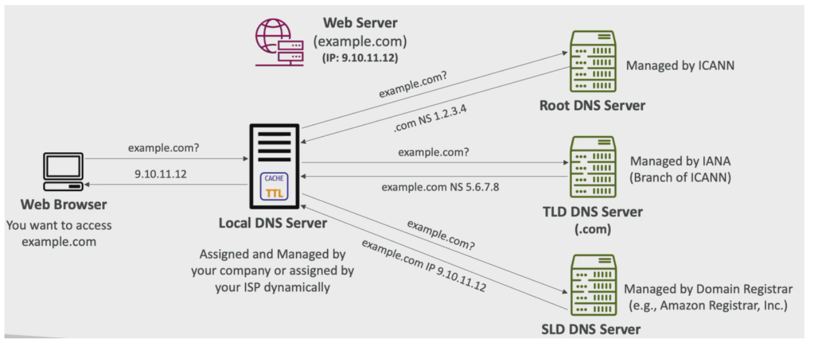

### Amazon Route 53

- A highly available, scalable, fully authoritative DNS
  - Authoritative = customer(you) can update the DNS records
- Also a Domain Registrar
- Ability to check health of your resources
- The only aws service that provides 100% availibility

### Route 53 record types

- A - maps a hostname to IPv4
- AAAA - maps a hostname to IPv6
- CNAME - maps a hostname to another hostname

### Route 53 hosted zones

Amazon Route 53 Hosted Zones are sets of DNS records that instruct how to direct traffic to a domain and its subdomains. There are two types of hosted zones:

`Public Hosted Zones:` These zones contain records that detail how to route traffic over the internet. For instance, a public hosted zone may define routing for a domain like "application.test.com."

`Private Hosted Zones:` Private hosted zones contain records specifying how to route traffic within one or more Virtual Private Clouds (VPCs). They are used for internal communication, such as routing for a domain like "application.test.internal."

Pricing for Route 53 hosted zones is $0.50 per month per hosted zone. This fee covers the management and maintenance of DNS records within the hosted zone, ensuring reliable and efficient traffic routing for your domains.

### Route 53 - TTL (Time TO Live)

Amazon Route 53 Time To Live (TTL) settings determine how long DNS information is cached by resolvers, affecting traffic flow and the responsiveness of record updates.

- **High TTL (e.g., 48 hours):**

  - _Impact:_ Less frequent queries to Route 53, possibly resulting in outdated domain information.
  - _Advantages:_ Reduces Route 53 traffic, but changes take longer to propagate.
  - _Considerations:_ Suitable for stable records where infrequent updates are acceptable.

- **Low TTL (e.g., 60 seconds):**
  - _Impact:_ More frequent queries to Route 53, incurring additional charges.
  - _Advantages:_ Quick updates as records are retrieved faster, making changes effective sooner.
  - _Considerations:_ Useful for rapidly changing environments or when quick updates are crucial, but may increase Route 53 costs.
  - `Note`: More traffic to route 53, More charge $$,Easy to change records, As updated records are retrieved faster

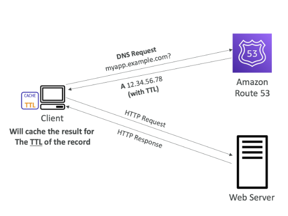
<figcaption>TTL (Time TO Live)</figcaption>

## CNAME & ALIAS Records

Imagine you have an AWS hostname: `lb-324.ap-south.elb.amazonaws.com`, and you want to point it to `home.test.com`. Here's how you can achieve it using CNAME and ALIAS records:

**CNAME Records**

- Used to point a hostname to another hostname (e.g., `home.test.com` → `xyz.something.com`).
- Applicable only for non-root domains (e.g., `home.test.com`), not for root domains (e.g., `test.com`).

**ALIAS Records**

- Used to point a hostname to an AWS resource (e.g., `home.test.com` → `xyz.amazonaws.com`).
- Works for both root and non-root domains (e.g., `home.test.com`, `test.com`).
- Free of cost.
- Comes with health check capabilities.

## Alias Records

Alias Records in AWS `Route 53` serve the following purposes:

- **Mapping Hostname to AWS Resource:**

  - Alias Records map a hostname to an AWS resource.

- **Top Node of DNS Namespace (Zone Apex):**

  - Alias Records can be used as the top node of the DNS namespace, allowing mapping for the root domain (Zone Apex) like `test.com`.

- **Always A/AAAA Record for AWS Resources:**

  - Alias Records always resolve to A (IPv4) or AAAA (IPv6) records for AWS resources.

- **Time-To-Live (TTL):**
  - `It's important to note that you can't manually set the TTL (Time-To-Live) for Alias Records.`

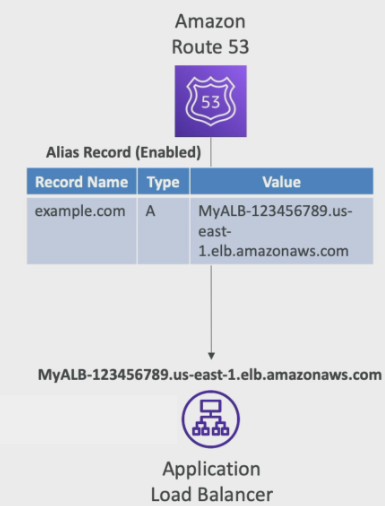
<figcaption>Alias Records</figcaption>

### Alias record targets

- Elastic load balancer
- Cloudfront distribution
- Api gateway
- Elastic beanstalk environment
- S3 websites
- VPC interface endpoints
- Route 53 record in same hosted zone

`Note: You can not set ALIAS for an EC2 DNS name`

## Routing policies for `Route 53`

Routing policy is condition how Route 53 will respond to DNS queries

- Simple
- Weighted
- Failover
- Latency based
- Geolocation
- Multi-value answer
- GeoProximity
- IP based

## Routing policy - Simple

<table>
  <tr>
    <td>
      <ul>
        <li>Typically route traffic to a single resource</li>
        <li>Can also have multiple values in the same record</li>
        <li>If multiple values are stored for a domain in Route 53, it returns all the values, and a random value is chosen at the client site</li>
        <li>Can't be associated with health checks</li>
      </ul>
    </td>
    <td>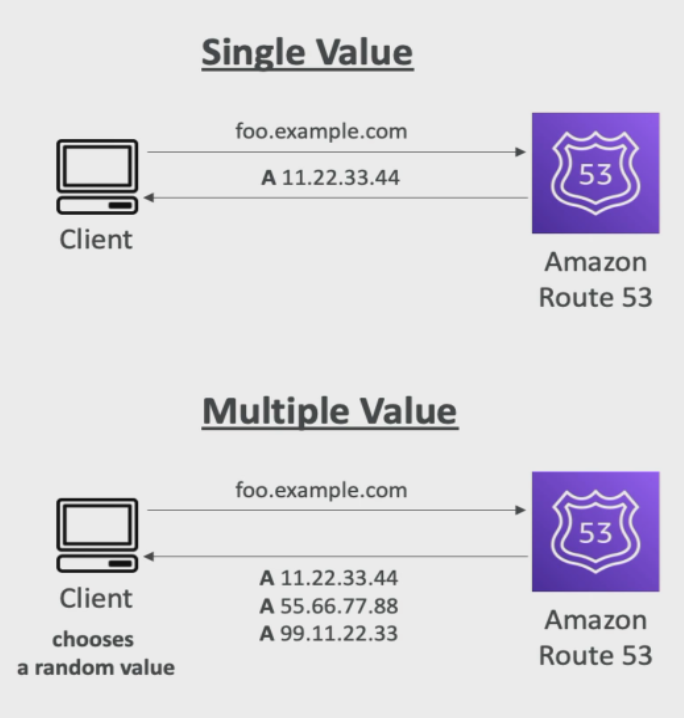</td>
  </tr>
</table>

## Routing policy - Weighted

- Control % of traffic go to each specific resource
- Weights dont need to sum up 100%
- `DNS` records must have same type
- Can be associated with health check
- Use case: load balancing between region, testing new application types etc.
- Record having weight 0 means `route53` will not be sending any traffic
- All records having weight `0` means `route53` will send traffic equally across records

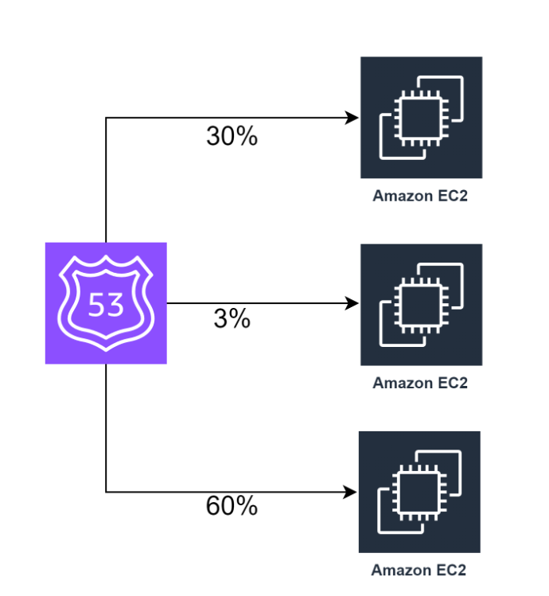

## Routing policy - Latency

- **Redirects to the resource with the least latency:**

  - Latency routing directs traffic to the AWS resource that offers the lowest latency, ensuring optimal response times for end-users.

- **Latency based on users and AWS regions:**

  - The latency is determined based on the geographical location of users and AWS regions, allowing for intelligent routing to minimize response times.

- **Ideal for prioritizing low latency:**

  - Latency routing is particularly useful when achieving low latency is a top priority, ensuring a better user experience for applications sensitive to response times.

  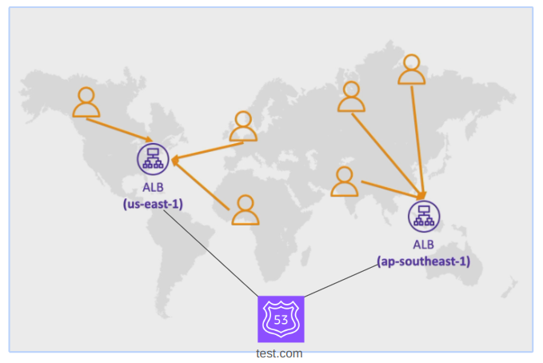
  <figcaption>Latency Routing</figcaption>

## Routing policy - Health checks

- About 15 global health checkers will check the endpoint health
  - healthy/unhealthy threshold `3 by default`(checked by 3 time to each 15 global checkers)
  - Interval - 30sec (`can set to 10sec ,higher cost$$`)
  - If >18% checkers report endpoint is healthy,then `route53` says its healthy, else unhealthy
- Health check pass only when the endpoint responds with 2xx/3xx code
- Can be set up to pass/fail based on the first 5120 bytes text based response
- Configure firewall to allow incoming request from `route53` health checkers

  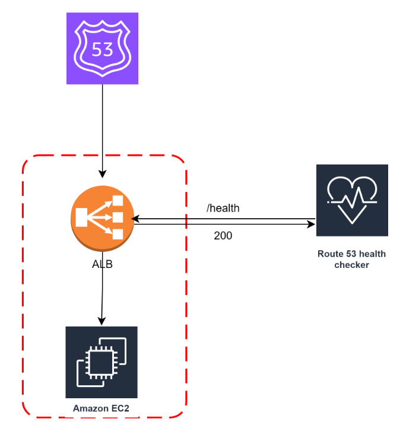
  <figcaption>Health checks</figcaption>

## Routing policy - Failover (Active-Passive)

- **Utilizes an Active-Passive failover configuration:**

  - Failover routing is designed for scenarios where one set of resources (the primary, active set) is designated to handle traffic, and a secondary set of resources (the standby, passive set) serves as a backup.

- **Automated failover process:**

  - `In the event of a failure or health check issue with the primary resources, Route 53 automatically directs traffic to the secondary (backup) resources to ensure continuity`.

- **Health checks determine resource availability:**

  - Health checks are associated with each set of resources to monitor their availability. Route 53 initiates failover based on the health check results.

- **Common use cases:**

  - `Failover routing is commonly employed for disaster recovery, ensuring business continuity by seamlessly redirecting traffic to standby resources during an outage or when the primary resources become unhealthy`.

  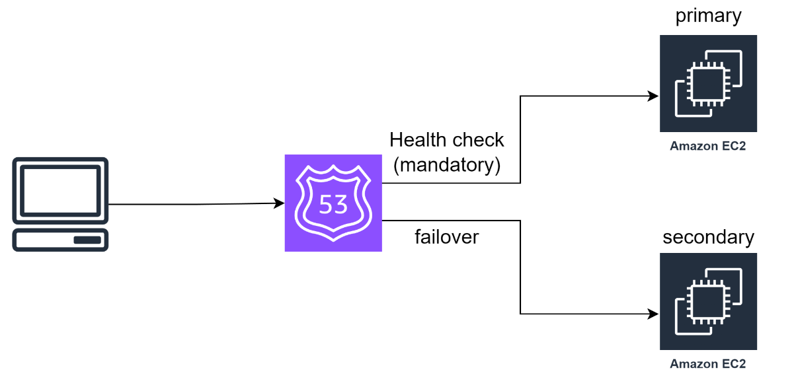
  <figcaption>Failover Routing</figcaption>

## Routing policy - Geolocation 

- Not same as latency based routing
- Routing based on users location
- Specify location by continent, country or by state
- Should create a default record
- Use cases: website localization, restrict content distribution,load balancing
- Can be associated with health checks

**`Note`:** Geolocation routing is employed to distribute traffic based on the geographical location of users. This can be utilized to:

- Distribute traffic country-wise.
- Create groups by multiple countries and manage permissions accordingly.
- Restrict access to specific countries.

This routing policy is especially useful for scenarios where precise geographical control over traffic distribution is required.

  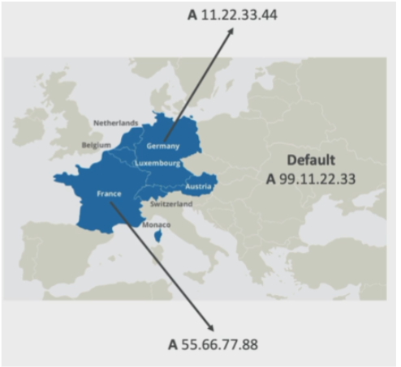
  <figcaption>Geolocation</figcaption>

## Routing policy - Geoproximity

Shifts traffic to your resources based on geographic location

- You define a bias value,depending on which more traffic will be attracted
- More bias value drives more traffic
- Less bias gets less traffic

You must use Route 53 traffic flow advanced feature to use this

<table>
<tr>
    <td>
  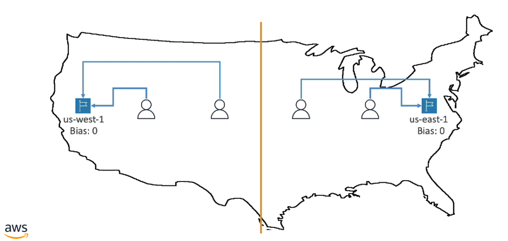</td>
    <td>
  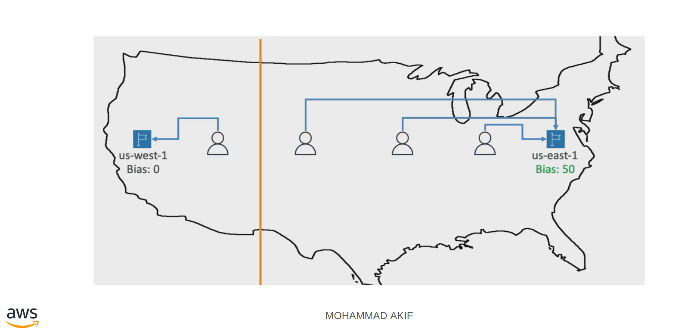</td>
</tr>
</table>

## Routing policy - ip based

- Routing based on client ip addresses
- You will provide a list of CIDRs for your clients and corresponding endpoints
- User `IP` to endpoint mappings

## Routing policy - Multi-Value

- `Route 53 `returns multiple values/resources
- Can be associated with health checks (unlike simple routing)
- So we can have a client site load balancing
- Up to 8 healthy records are returned for each multi-value query

## Instantiating Applications quickly

When launching fullstack aws services EC2,EBS,EFS,RDS it take time to

- Install packages
- Prepare runtime environment
- Insert initial data
- Configure everything
- Install application
- Launch application

`How do we make this process faster?`

### Instantiating Applications quickly P-1

**EC2 Instances:**

- Use a `Golden AMI`: Install your applications, OS dependencies, packages etc beforehand and make a AMI. Launch your EC2 instance from the `Golden AMI`
- Bootstrap Using `User Data`: for dynamic configuration use `User data` scripts
- Hybrid: mix `Golden AMI` + `User data`

**RDS DB**

- Restore from snapshot: the DB will have the schemas and ready

**EBS volume**

- Restore from a snapshot and all the data ready

## Elastic Beanstalk

- A developer just want their code to run, doesn't want to do aws administrative tasks and manage complex infrastructure, configure db, load balancer, autoscaler .. .. .. etc
- Elastic beanstalk is a developer oriented service for deploying application on aws
- It uses EC2, ASG,ELB,RDS.. .. etc and bundles the configuration give us a simple way of deploying well architected framework
- It automatically handless capacity provisioning,load balancing,application health monitoring, logging, instance configuration and so on
- Just the application code is the responsibility of the developer
- Beanstalk supports wide range of programming languages and docker containers, if your programming language is not supported you can make it support by creating custom environment for it
- Beanstalk is free but we pay for underlying resources

  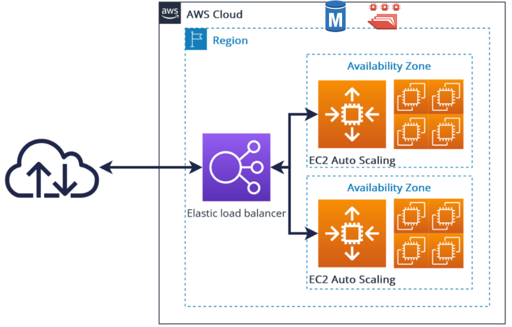
  <figcaption>Elastic Beanstalk</figcaption>

### Elastic Beanstalk - web tier & worker tier

<figure style="">
  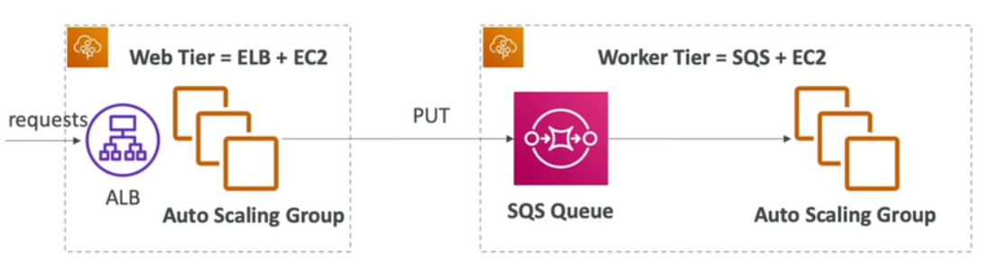
  <figcaption>Elastic Beanstalk - web tier & worker tier</figcaption>
</figure>
