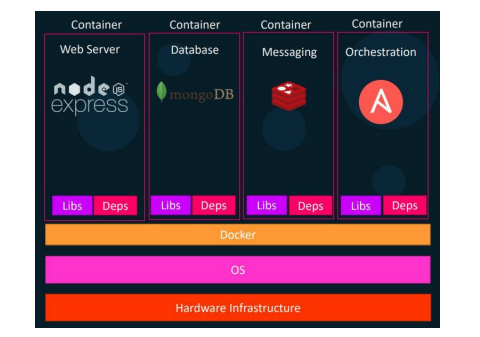
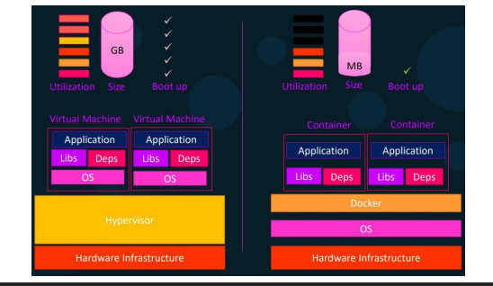
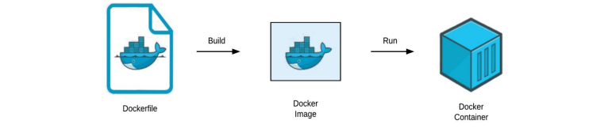

# Docker Certified Associate (DCA) Course

## Docker History
#### Here's a brief history of Docker:

`2013:` Docker was created by Solomon Hykes at dotCloud, a cloud-hosting company. It started as an internal project to improve the development and deployment process.

`2013-2014:` Docker gained rapid popularity due to its innovative approach to containerization. Initially, Docker used LXC (Linux Containers) as its default execution environment.

`March 2014: `Docker was open-sourced, making it accessible to a wider community of developers. This move contributed significantly to its growth and adoption.

`Technology:` Docker is primarily written in the Go programming language, which is known for its efficiency and concurrency support. This choice of language has helped Docker to be lightweight and efficient in managing containers.

Overall, Docker revolutionized the way applications are developed, shipped, and deployed by providing a standardized platform for containerization. Its ease of use, portability, and scalability have made it a fundamental tool in modern software development and deployment workflows.

## Why do you need docker & What can it do?
Dockerization offers several advantages over traditional approaches such as
using virtual machines (VMs) or bare-metal servers.

1. Containerize Applications
    - Package wise customization
2. Run each service with its dependencies in separate containers
3. Consistent & Isolated Environment
4. Rapid Application Deployment
5. Ensures Scalability & Flexibility
    - Easily switchable
    - Containerize Tools:- Kubernative
6. DevOps and Continuous Integration/Continuous Deployment (CI/CD)
7. Better Portability
8. Cost-Effective
9. In-Built Version Control System
    - Easily Version Control
10. Resource Utilization:
11. Security

`NSible` - Infrastucere as a code. Update multiple servers.

## What are containers?
A container is a unit of software that packages code and its dependencies so the application runs quickly and reliably across computing environments.

Docker containers are lightweight, standalone, and executable packages that contain all the necessary components to run a piece of software, including the code, runtime, libraries, system tools, and settings. Containers are based on containerization technology, and Docker is one of the most popular containerization platforms.

Here are the key characteristics and components of Docker containers:
1. Isolation
Containers provide process and file system isolation. Each container runs in its own user space, separate from the host and other containers. This isolation ensures that applications and dependencies do not interfere with each other
2. Portability
Containers encapsulate an application and its dependencies, making it highly portable. They can run consistently across different environments, such as development, testing, and production, without concerns about underlying system differences.
3. Lightweight
Containers share the host operating system's kernel and do not require a full operating system stack for each instance. This makes them lightweight and allows for faster startup times compared to traditional virtual machines.
4. Efficiency
Because containers share the host OS kernel, they use fewer resources compared to virtual machines. This enables efficient resource utilization and allows for running multiple containers on the same host without significant overhead.
5. Docker Engine
Docker containers are managed by the Docker Engine, which is a client-server application. The Docker Engine consists of a daemon process (the server) and a command-line interface (the client). The client communicates with the daemon to build, run, and manage containers.
6. Orchestration:
Docker containers can be orchestrated and managed using tools like Docker Compose or Kubernetes. These tools enable the deployment, scaling, and management of multi-container applications.

## Containers vs Virtual Machines

Virtual machines is that virtual machines virtualize an entire machine down to
the hardware layers and containers only virtualize software layers above the
operating system level.

## How is it done?

### What is a Docker Registry?
The registry allows Docker users to pull images locally, as well as push new
images to the registry (given adequate access permissions when applicable).

### DockerHub
DockerHub is a hosted registry solution by Docker Inc. Besides public and
private repositories, it also provides automated builds, organization
accounts, and integration with source control solutions like GitHub and
Bitbucket.

### Their Public Registries
Amazon Elastic Container Registry (ECR)
Google Container Registry (GCR)
Azure Container Registry (ACR)

### Overview of Docker editions!

1. Docker Engine Community: Ideal for individual developers and small
teams looking to get started with Docker and experimenting with
container-based apps.

2. Docker Engine Enterprise: Designed for enterprise development of a
container runtime with security and an enterprise-grade SLA in mind.

3. Docker Enterprise: Designed for enterprise development and IT teams who
build, ship, and run business-critical applications in production at scale.

[Ref Link]

## Dockerfile, Image & Container

Dockerfile: Docker images are created using a special script called a Dockerfile. The Dockerfile defines the steps to build the image, specifying the base image, adding dependencies, and configuring the application.

Image: Compiled Dockerfile. Saves you time from rebuilding the Dockerfile every time you need to run a container. And it's a way to hide your provision
code.

Containers: Containers offer a lightweight and efficient way to package and run applications, it's provide a consistent and isolated environment.

### Install Docker Engine on Ubuntu Click  <a href="./docker_install_ubuntu.md">Here</a>
