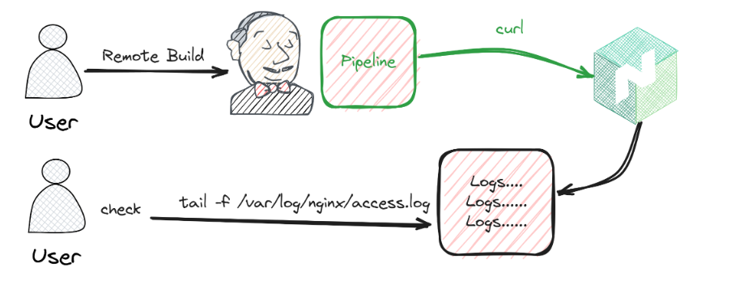

### Basic Pipeline Free Style Project Sample Test
`Execute Basic Bash Scripts`
```
pwd
ls
hostname
```

`Curl Job url to curl a nginx website`
```
// curl ip-address
curl 43.205.236.210
```
If we build this test, we can see action here `sudo tail -f /var/log/nginx/access.log`.

<table>
  <tr>
    <td></td>
    <td></td>
  </tr>
</table>

#### How to run this free style project through url
- First need to check `Trigger build remotely`
- Then set authentication token
- Then get final url, like:- `JENKINS_URL/job/001/build?token=TOKEN_NAME`
- After complete all step, you should able to build job through by url.

#### Build jobs periodically
- Follow this link click [here](https://crontab.guru/)

#### GitHub hook trigger for GITScm polling


#### Poll SCM
- A cronjob, at every cron event jenkins scans the github repository if anything changed there.
- If nothing new is committed, jenkins doesn't do anything
- If new data is pushed in the repo, jenkins pulls the github code
- And do whatever we instruct it to do
