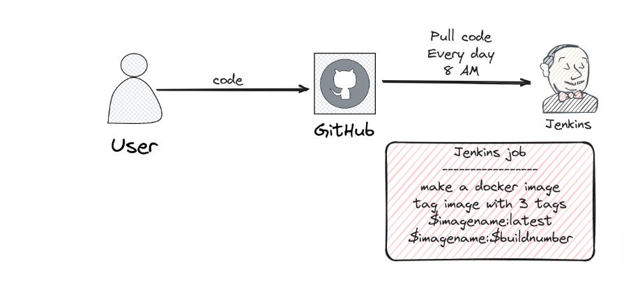
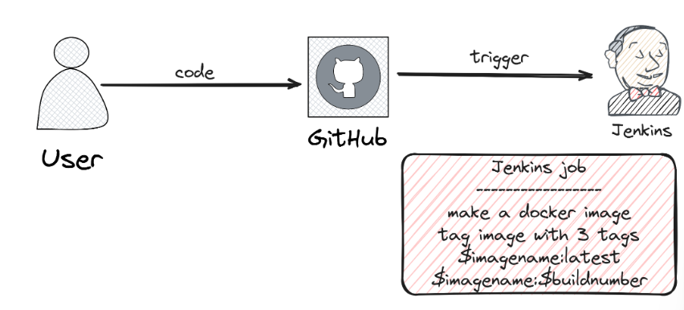

## Environment Variables

In Jenkins, environment variables play a significant role in configuring and customizing the behavior of your Jenkins jobs and builds. These variables can be used to pass information from the Jenkins server to the jobs and also within different jobs and build steps. Here are some commonly used Jenkins environment variables:

### Jenkins Built-in Variables

1. **`BUILD_NUMBER`**: The build number of the current build.

2. **`BUILD_ID`**: The ID of the current build (e.g., `build-1234`).

3. **`BUILD_DISPLAY_NAME`**: The display name of the current build, usually the same as the build number.

4. **`JOB_NAME`**: The name of the current job.

5. **`BUILD_TAG`**: A tag for the current build (e.g., `jenkins-JOB_NAME-BUILD_NUMBER`).

6. **`EXECUTOR_NUMBER`**: The unique identifier of the current executor (or build agent).

7. **`WORKSPACE`**: The path to the workspace where the job is executed.

8. **`HUDSON_HOME`**: The Jenkins home directory.

9. **`HUDSON_URL`**: The URL of the Jenkins server.

10. **`NODE_NAME`**: The name of the node the build is running on.

11. **`NODE_LABELS`**: A space-separated list of labels assigned to the node.

12. **`BUILD_URL`**: The URL of the current build.

13. **`JOB_URL`**: The URL of the job.

14. **`GIT_COMMIT`**: The current Git commit hash, if the job is using a Git repository.

15. **`GIT_BRANCH`**: The current Git branch, if the job is using a Git repository.

### Configuring Custom Environment Variables

You can also configure custom environment variables in your Jenkins job by:

1. **Using the "Environment Variables" section**: In the job configuration page, there is an "Environment Variables" section where you can define custom key-value pairs.

2. **Using build wrappers**: Jenkins plugins may offer build wrappers that allow you to configure environment variables.

3. **Using pipeline scripts**: In Jenkins Pipeline, you can configure environment variables using the `withEnv` block or directly setting them with the `env` object.

### Example: Setting Environment Variables in a Pipeline Script

```groovy
pipeline {
    agent any
    environment {
        MY_VAR = 'value'
        ANOTHER_VAR = 'another_value'
    }
    stages {
        stage('Example Stage') {
            steps {
                script {
                    echo "MY_VAR is $MY_VAR"
                    echo "ANOTHER_VAR is $ANOTHER_VAR"
                }
            }
        }
    }
}
```

In the above example, `MY_VAR` and `ANOTHER_VAR` are custom environment variables set within a Jenkins pipeline.

Understanding and utilizing environment variables is essential for effectively managing your Jenkins jobs and ensuring that your builds behave as expected.

### Clone Git Project 
- Install Docker
- Set jenkins in docker group.
- Set ubuntu user in docker group like this `docker:x:988:jenkins,ubuntu`.
- 

<table>
  <tr>
    <td></td>
    <td></td>
  </tr>
</table>