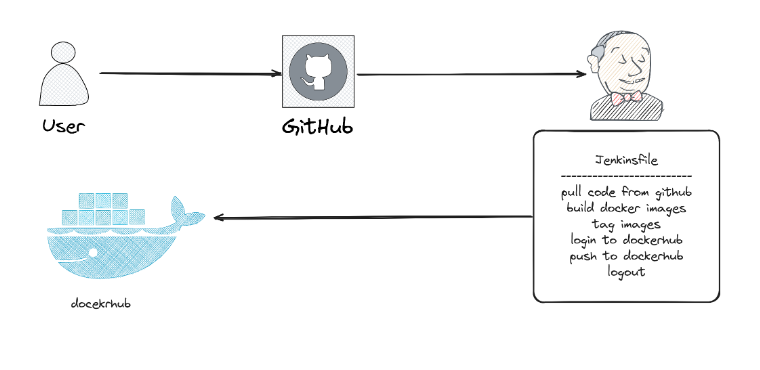

## What Is Jenkinsfile

A Jenkins pipeline is an automated process that builds, tests, and deploys your application. 

A **Jenkinsfile** is a text file that defines this pipeline and is stored in your version control system (like Git). 

Benefits of using a Jenkinsfile include:

1. **Version Control**: Track and manage changes to your pipeline.
2. **Consistency**: Ensure the same process runs in different environments.
3. **Collaboration**: Developers and operations teams can work together more easily.
4. **Reproducibility**: Easily replicate build and deployment processes.
5. **Automation**: Reduce manual work and improve reliability.

Here's a simple example of a Jenkinsfile:

```groovy
pipeline {
    agent any
    stages {
        stage('Build') {
            steps {
                echo 'Building...'
            }
        }
        stage('Test') {
            steps {
                echo 'Testing...'
            }
        }
        stage('Deploy') {
            steps {
                echo 'Deploying...'
            }
        }
    }
}
```

In this example, the pipeline has three stages: Build, Test, and Deploy, each performing specific actions.

### Post Action

<table>
  <tr>
    <td></td>
  </tr>
</table>