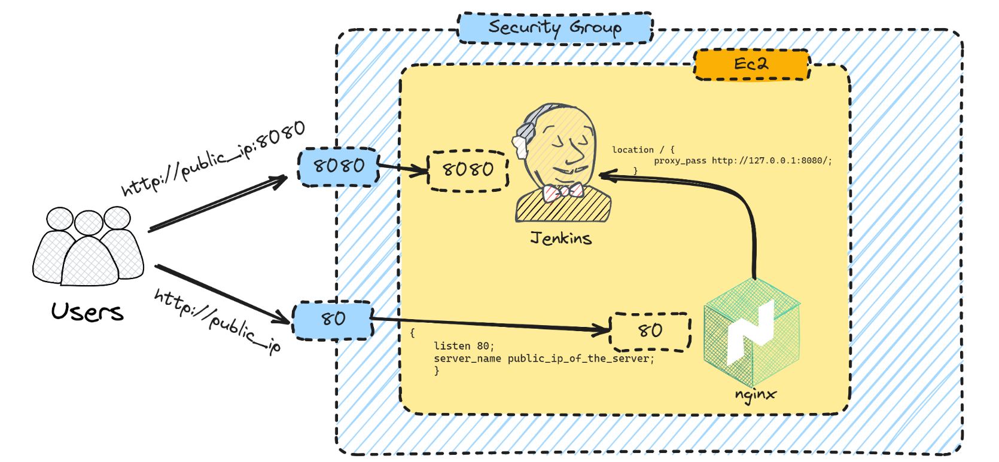

# 🚀 Jenkins Domain Integration 🚀

#### Step-1: Initial need to Install Nginx
```
sudo apt update
sudo apt install nginx
```
In more details click [Here](https://www.digitalocean.com/community/tutorials/how-to-install-nginx-on-ubuntu-22-04)

#### Step-2: Configure Nginx
- After installation, you can configure Nginx by editing the configuration files located in `/etc/nginx/.
Create a new configuration file for your website, for example: /etc/nginx/sites-available/jenkins.com
- Configure Nginx @ /etc/nginx/sites-available/jenkins.com
- Configure your website settings in this file according to your requirements.

sample configure file for `/` home page redirect in `jenkins`:-
```
server {
    listen 80;
    server_name 13.233.87.109; # Replace with your domain or server IP


    location / {
        proxy_pass http://127.0.0.1:8080/; // default jenkins port
        proxy_set_header Host $host;
        proxy_set_header X-Real-IP $remote_addr;
        proxy_set_header X-Forwarded-For $proxy_add_x_forwarded_for;
        proxy_set_header X-Forwarded-Proto $scheme;
    }

}
```

#### Step-3: Enable Configuration
Create a symbolic link (symlink) from your configuration file in `sites-available` to `sites-enabled` to enable your website configuration. This is typically done using the `ln -s` command:
```
sudo ln -s /etc/nginx/sites-available/customname.xyz /etc/nginx/sites-enabled/
```
#### Step-4: Test Nginx Configuration:
Before reloading Nginx, it's a good practice to test the configuration to ensure there are no syntax errors:
```
sudo nginx -t
```
#### Step-5: Reload Nginx: 
If the test is successful, reload Nginx to apply the new configuration changes:
```
sudo systemctl reload nginx
``` 
By following these steps, you should have Nginx installed, configured for jenkins website. Must be follow jenkins intallation.

## Domain Integration via Nginx


### Add Certificate By CertBot
Follow this steps [Here](https://certbot.eff.org/)
### Domain Integration via Nginx
- Must be need set DNS(domain). with ssl certificate apply.
- Follow this steps [Here](https://www.jenkins.io/doc/book/system-administration/reverse-proxy-configuration-with-jenkins/reverse-proxy-configuration-nginx/)