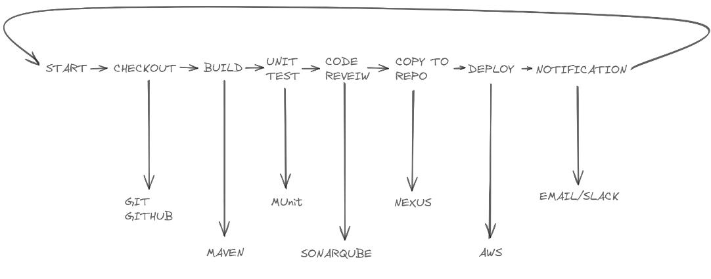

## Getting Started With Jenkins
### Why Jenkins?
- Easy Integration
- Open Source With Paid Options
- Plugin Support
- Complex Pipelines
- Scalability

### Jenkins Introduction
Jenkins is an open-source automation server widely used for Continuous Integration (CI) and Continuous Delivery (CD) processes in software development. Originally developed as the Hudson Project by Sun Microsystems in 2004, it underwent a significant transformation in 2011 due to a dispute between Oracle, who owned Sun Microsystems, and the Hudson open-source community.

Jenkins is written in Java and provides a web-based interface that allows users to configure automation tasks, build pipelines, and integrate with various tools and services commonly used in software development.

### What can I implement with Jenkins ?
With Jenkins, you can implement a variety of automation tasks and processes that streamline your software development lifecycle. Here are some examples of what you can implement with Jenkins:

1. **Continuous Integration (CI)**: Set up automated builds triggered by code commits to your version control system. Jenkins can compile your code, run automated tests, and generate reports, ensuring that each code change integrates smoothly with the existing codebase.

2. **Automated Testing**: Jenkins can execute various types of automated tests, including unit tests, integration tests, and end-to-end tests. You can configure Jenkins to run these tests automatically after each code commit, providing rapid feedback on the code quality.

3. **Code Quality Analysis**: Integrate code quality analysis tools such as SonarQube or Checkstyle with Jenkins to analyze your code for potential issues, bugs, and security vulnerabilities. Jenkins can generate reports and notifications based on the analysis results.

4. **Code Coverage**: Utilize Jenkins to measure code coverage by running code coverage analysis tools like JaCoCo or Cobertura. Jenkins can track code coverage trends over time and notify you if code coverage falls below a certain threshold.

5. **Static Code Analysis**: Integrate static code analysis tools like FindBugs, PMD, or ESLint with Jenkins to identify code style violations, potential bugs, and other code quality issues. Jenkins can provide feedback to developers and enforce coding standards automatically.

6. **Deployment Automation**: Implement automated deployment pipelines with Jenkins to deploy your applications to various environments, such as development, staging, and production. Jenkins can orchestrate deployment tasks, including packaging, versioning, and deploying artifacts to servers or cloud platforms.

7. **Notifications and Alerts**: Integrate Jenkins with collaboration tools like Slack to receive notifications, alerts, and reports directly in your team's communication channels. Jenkins can notify team members about build status, test results, and other important events, simplifying communication and collaboration.

8. **Pipeline as Code**: Define your build and deployment pipelines as code using Jenkins Pipeline DSL or Jenkinsfile. This allows you to version-control your pipelines, review changes, and promote best practices for building, testing, and deploying software.

By leveraging Jenkins for task automation, code review acceleration, code coverage analysis, coding efficiency enhancement, and audit simplification with tools like Slack, you can significantly improve the efficiency, quality, and reliability of your software development processes.
### Jenkins Flow

