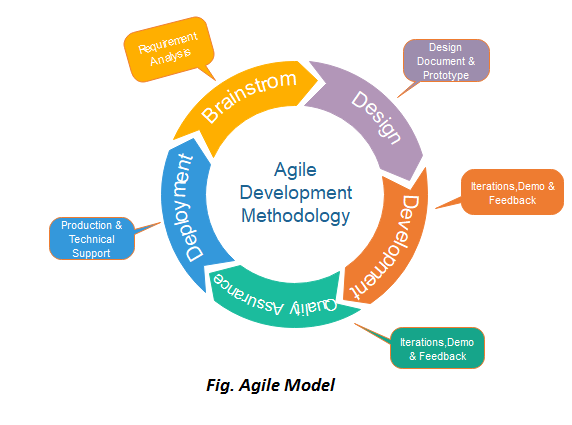

## Introduction To SDLC

The Software Development Life Cycle (SDLC) is a crucial framework in the field of software engineering, guiding the process of creating and maintaining software systems. It consists of several phases, each with its own set of activities, deliverables, and goals. Let's see into each phase of the SDLC:

1. **Plaining**: 
- In this phase, the project scope, objective, requiremnets, constraints and resouces are defined.
- Key activities include feasibility studies, requirements gathering, and creating a project plan.

2. **Analysis**
- Requirements gathered in the plaining phase are analyzed in details to ensure clarity and completeness.
- Stakeholders collaborate to define the system's functional and non-functional requirements.

3. **Design**
- In this phase, the systems architecture and design are developed based on the requirements.
- It includes creating high-level and low-level design, defining data structures, algorithms, and interfaces.

4. **Implementation**
- Devolopers write code according to the design specification.
- This phase involves coding, unit testing, integration testing, and debugging to ensure the software function as intended.

5. **Testing:**
- The software is thoroughly tested to identify and fix defects.
- Testing includes various techniques such as functional testing, performance testing, security testing, and user acceptance testing.
6. **Deployment:**
- The software is deployed to the production environment or released to end-users.
- Deployment may involve installation, configuration, data migration, and user training.
7. **Maintenance:**
- After deployment, the software enters the maintenance phase where it is monitored, updated, and enhanced as needed.
- Maintenance activities include bug fixes, performance optimization, feature enhancements, and addressing user feedback.

### Key Principles and Benefits of SDLC:
1. **Structured Approach:** SDLC provides a systematic and organized method for software development, ensuring consistency and predictability.
2. **Risk Management:** By breaking down the project into phases, SDLC helps identify and mitigate risks early in the process.
3. **Quality Assurance:** Each phase of the SDLC incorporates testing and validation activities to ensure the software meets quality standards.
4. **Cost and Time Management:** SDLC helps in estimating and managing project costs and timelines effectively.
5. **Stakeholder Collaboration:** SDLC promotes collaboration among stakeholders, including developers, testers, project managers, and end-users, leading to better communication and alignment of expectations.

The Software Development Life Cycle is a comprehensive framework that guides the entire software development process from inception to maintenance, ensuring the delivery of high-quality software products that meet user needs and business objectives.

### SDLC Models
1. Waterfall Model
2. Agile Model
3. Spiral Model
4. V-Model (Verification and Validation Model)
5. Iterative Model
6. Incremental Model
7. Rapid Application Development (RAD)
8. Big Bang Model

### Waterfall Model:

<table>
  <tr>
    <td>
        <ul>
            <li>Sequential linear approach where each phase must be completed before the next one begins. </li>
            <li>Phases: Requirements, Design, Implementation, Testing, Deployment, Maintenance. </li>
            <li>Suitable for projects with well-defined and stable requirements. </li>
        </ul>
    </td>
    <td></td>
  </tr>
</table>

#### Waterfall Model Not Suitable Where:
- Significant Changes Is Required
- Mid Project Adjustments
- Ongoing Customer Feedbacks Must Be Incorporated
- Two Process Are Performed Simultaneously 
- Short Term Release

### Agile Model

Agile is a software development methodology that emphasizes flexibility, collaboration, and customer feedback. It prioritizes delivering working software quickly and responding to change over rigid planning and documentation. Some key characteristics of Agile include:

  

### 1. Iterative Adaptive Manner:
  - Agile projects progress through iterations or sprints, typically lasting 1-4 weeks.
  - At the end of each iteration, a potentially shippable product increment is delivered.
  - Teams continuously assess and adapt their approach based on feedback and changing requirements.

### 2. Small Short Releases:
  - Agile encourages delivering software in small, frequent releases rather than one large release at the end.
  - Each release provides tangible value to the customer and allows for quick validation and adjustment.

### 3. Dividing Into Chunks:
   - Agile breaks down the project into manageable chunks of work, often called user stories or features.
   - Teams prioritize these chunks based on customer value and implement them incrementally.

### 4. Microservice-Based Architecture:
   - Agile teams often utilize microservices architecture to build complex systems.
   - Microservices are small, independent services that focus on specific business capabilities.
   - They enable teams to develop, deploy, and scale components independently, facilitating agility and rapid iteration.

### Benefits of Agile:
- **Flexibility:** Agile allows teams to adapt to changing requirements and market conditions quickly.
- **Customer Satisfaction:** By delivering working software frequently and involving customers throughout the process, Agile ensures the product meets their needs.
- **Reduced Risk:** Iterative development and continuous feedback mitigate risks associated with large-scale projects.
- **Improved Quality:** Agile practices such as continuous integration and testing result in higher-quality software.
- **Increased Collaboration:** Agile promotes close collaboration between cross-functional teams, leading to better communication and alignment.

Overall, Agile methodologies provide a framework for delivering value to customers efficiently and effectively in today's fast-paced and dynamic business environment.

### DevOps Culture
DevOps culture and its relationship with Agile practices. It provides a clear understanding of DevOps principles and its significance in modern software development processes.Here's a breakdown of each point:
1. **Alignment of Development and Operations Teams:** DevOps emphasizes collaboration and alignment between development and operations teams, breaking down silos and promoting shared responsibilities.

2. **Infrastructure Maintenance:** DevOps extends beyond software development to encompass the maintenance and management of the infrastructure where the software runs, emphasizing the importance of infrastructure as code and automation.

3. **Automation:** DevOps strongly advocates for automation of processes wherever possible, including development, testing, deployment, and infrastructure management, to improve efficiency and reliability.

4. **Incorporation into Agile Practices:** Development, testing, and deployment activities occur within both Agile and DevOps methodologies. Traditional Agile methodologies may lack a focus on operations, which DevOps addresses by integrating operations into the software delivery process.

5. **Not an SDLC Model:** DevOps is not a specific Software Development Life Cycle (SDLC) model but rather a cultural and organizational approach to software delivery, focusing on collaboration, automation, and continuous improvement.

6. **Fulfillment of Agile Principles:** DevOps complements Agile practices by extending them to include operations, infrastructure management, and continuous delivery. It enhances the Agile approach by addressing the entire software delivery lifecycle.

7. **Evolution or Missing Piece of Agile:** DevOps can be seen as an evolution of Agile practices, building upon Agile principles and extending them to include operations. Alternatively, it can be viewed as a missing piece of Agile, filling the gap in traditional Agile methodologies by incorporating operations into the software delivery process.

