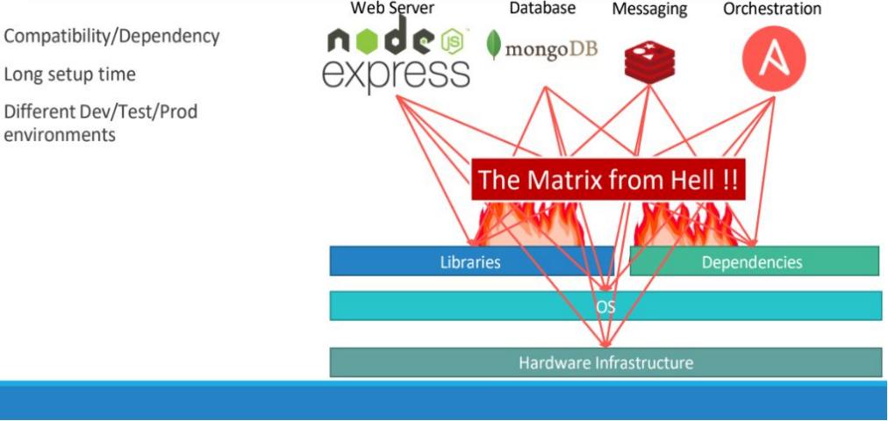
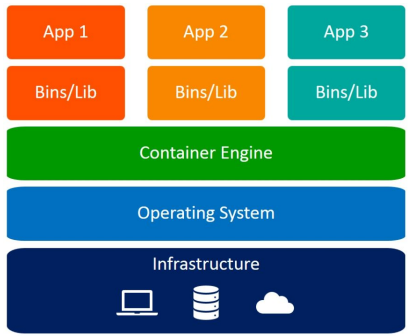

# Introduction of Kubernetes(K8s)
## Introduction 

Kubernetes is an open source container orchestration platform that automates many of the manual processes involved in deploying, managing, and scaling containerized applications. It has a large, rapidly growing ecosystem. Kubernetes services, support, and tools are widely available.

The name Kubernetes originates from Greek, meaning helmsman or pilot. K8s as an abbreviation results from counting the eight letters between the "K" and the "s".

### Who contributes to Kubernetes?
Kubernetes was originally developed and designed by engineers at Google.
- 2014 Google Introduces Kubernetes
- mid-2014: Google introduced Kubernetes as an open source version of Borg
- June 7 Initial release – first github commit for Kubernetes
- July 10 Microsoft, RedHat, IBM, Docker joins the Kubernetes community.

Google donated the Kubernetes project to the newly formed Cloud Native Computing Foundation (CNCF) in 2015.

## What is Kubernetes? 

Kubernetes is indeed an open-source container orchestration system designed to automate software deployment, scaling, and management. To grasp Kubernetes fully, it's essential to understand two fundamental concepts: containers and orchestration.

### Container:

A container is a lightweight, standalone, executable package of software that includes everything needed to run an application: code, runtime, system tools, system libraries, and settings. Unlike virtual machines, containers do not bundle an entire operating system; instead, they share the host system's kernel and isolate the application processes from each other. This isolation provides consistency across different computing environments and enables applications to run reliably when moved from one environment to another.

#### Why do you need containers?

<table>
    <tr>
    <td>
        <h1>Why do you need containers?</h1>
    </td>
    <td>
        <h1>What can it Do?</h1>
    </td>
  </tr> 
  <tr>
    <td></td>
    <td></td>
  </tr>
</table>

### So what are containers? 

<table>
  <tr>
    <td>
        <ul>
            <li> Containers are completely isolated environments, as in they can have their own processes or services, their own network interfaces, their own mounts. </li>
            <li> Just like Virtual machines, except that they all share the same OS kernel. </li>
        </ul>
    </td>
    <td></td>
  </tr>
</table>

### Container vs Virtual Machines

### Orchestration: 

Container Orchestration refers to the management and coordination of multiple containers within a distributed application. It involves automating tasks such as deployment, scaling, and management of containers to ensure efficient and reliable operation. Key aspects of container orchestration include: In the context of Kubernetes, orchestration involves tasks such as:

- **Deploying containers:** Kubernetes automates the deployment of containerized applications across a cluster of machines, abstracting the underlying infrastructure details.
- **Scaling applications:** Kubernetes can automatically scale the number of container instances based on factors like CPU or memory usage, ensuring that applications can handle varying levels of traffic.
*Imagine a sudden surge in traffic to your application. Container orchestration tools can automatically detect this and spin up additional containers to handle the load. Conversely, during low-traffic periods, they can scale down the number of containers running, saving on resources.*
- **Managing resources:** Kubernetes manages the allocation of computing resources such as CPU and memory to containers, optimizing resource utilization across the cluster.
- **Service discovery and load balancing:** Kubernetes provides mechanisms for services to discover and communicate with each other within the cluster, as well as load balancing traffic across multiple instances of an application.
- **Self-healing:** Kubernetes monitors the health of containers and automatically restarts or replaces containers that fail or become unresponsive, ensuring high availability of applications.
- **Rolling updates and rollbacks:** Kubernetes supports rolling updates, allowing applications to be updated without downtime by gradually replacing old container instances with new ones. It also enables rollbacks to previous versions if updates cause issues.

Overall, container orchestration is a game-changer for organizations that are adopting containerized technologies. It simplifies container management, improves application scalability and reliability, and allows for more efficient use of resources.

#### Top Container Orchestration:
1. Kubernetes
2. Red Hat OpenShift
3. Apache Mesos
4. Mirantis Kubernetes Engine
5. Helios
6. Amazon Elastic Container Service (Amazon ECS)
7. Google Kubernetes Engine (GKE)
8. Azure Service Fabric
9. Amazon Elastic Kubernetes Service (EKS)
10. Docker Swarm

### What are Kubernetes clusters?
A Kubernetes cluster is a collection of interconnected physical or virtual machines (nodes) that collaborate to run containerized applications. These clusters can span across various environments, including on-premise data centers, public clouds, private clouds, or hybrid cloud setups.Key components of a Kubernetes cluster include:-`Master Node`, `Worker Node`, `etcd`, `Kubelet`, `Kube Proxy`, `Pods`, `Controller Manager`, `Scheduler`.

**Master Node:** The master node is responsible for managing the cluster's overall state and coordinating communication between various components. It hosts several control plane components such as the API server, scheduler, and controller manager.

- `Kubernetes API Server:` The Kubernetes API server exposes the Kubernetes API, which acts as the frontend for the Kubernetes control plane. It handles all requests and commands, including creating, updating, and deleting resources within the cluster. The API server is the primary interface for users, administrators, and other components to interact with the Kubernetes cluster.
- `Controller Manager:` The Controller Manager is responsible for maintaining the desired state of various Kubernetes resources. It includes multiple controllers that monitor the state of resources such as pods, services, and deployments and takes corrective actions to ensure that the actual state matches the desired state. Examples of controllers include the Replication Controller, ReplicaSet Controller, Deployment Controller, and StatefulSet Controller.
-  `Scheduler:` The scheduler is responsible for assigning pods to worker nodes based on resource requirements, constraints, and other policies. It evaluates various factors to make optimal scheduling decisions and ensures efficient resource utilization.

**Worker Node:** Worker nodes, also known as minion nodes, are the machines where containerized applications are deployed and run. They are managed by the master node and execute tasks assigned to them.

**etcd:** etcd is a distributed key-value store that stores the cluster's configuration data and serves as its primary datastore. It ensures consistency and reliability by providing a reliable way to store and retrieve critical information.

**Kubelet:** Kubelet is an agent that runs on each worker node and is responsible for managing the containers on that node. It interacts with the master node's API server to receive instructions on which containers to run and ensures that they are running as expected.

**Kube Proxy:** Kube Proxy is a network proxy that runs on each worker node and helps to maintain network rules required for communication between pods and external traffic. It performs tasks such as load balancing, service discovery, and network routing.

**Pods:** Pods are the smallest deployable units in Kubernetes and encapsulate one or more containers. They share the same network namespace and can communicate with each other using localhost. Pods are scheduled and managed by the Kubernetes scheduler.

### Kubernetes Components and Architecture!

